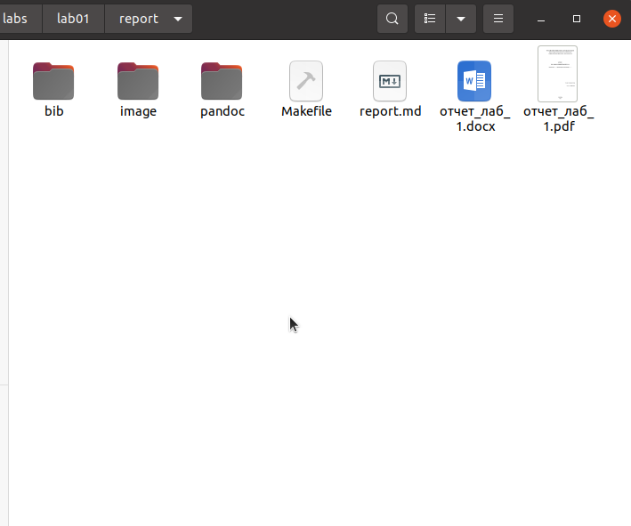

---
## Front matter
title: "Отчёт по лабораторной работе 2"
subtitle: "дисциплина:	Архитектура компьютера"
author: "Симдянов Тимур НПИбд-03-24 "

## Generic otions
lang: ru-RU
toc-title: "Содержание"

## Bibliography
bibliography: bib/cite.bib
csl: pandoc/csl/gost-r-7-0-5-2008-numeric.csl

## Pdf output format
toc: true # Table of contents
toc-depth: 2
lof: true # List of figures
lot: true # List of tables
fontsize: 12pt
linestretch: 1.5
papersize: a4
documentclass: scrreprt
## I18n polyglossia
polyglossia-lang:
  name: russian
  options:
	- spelling=modern
	- babelshorthands=true
polyglossia-otherlangs:
  name: english
## I18n babel
babel-lang: russian
babel-otherlangs: english
## Fonts
mainfont: PT Serif
romanfont: PT Serif
sansfont: PT Sans
monofont: PT Mono
mainfontoptions: Ligatures=TeX
romanfontoptions: Ligatures=TeX
sansfontoptions: Ligatures=TeX,Scale=MatchLowercase
monofontoptions: Scale=MatchLowercase,Scale=0.9
## Biblatex
biblatex: true
biblio-style: "gost-numeric"
biblatexoptions:
  - parentracker=true
  - backend=biber
  - hyperref=auto
  - language=auto
  - autolang=other*
  - citestyle=gost-numeric
## Pandoc-crossref LaTeX customization
figureTitle: "Рис."
tableTitle: "Таблица"
listingTitle: "Листинг"
lofTitle: "Список иллюстраций"
lotTitle: "Список таблиц"
lolTitle: "Листинги"
## Misc options
indent: true
header-includes:
  - \usepackage{indentfirst}
  - \usepackage{float} # keep figures where there are in the text
  - \floatplacement{figure}{H} # keep figures where there are in the text
---

# Цель работы

Целью исследования является изучение концепции и использование инструментов контроля версий с целью получения практического опыта работы с системой git.

# Выполнение лабораторной работы

## Подготовка репозитория

Для начала создадим учётную запись на сайте https://github.com/ 
и заполните основные данные (рис. [-@fig:001])

{ #fig:001 width=70%, height=70% }

Сначала сделаем предварительную конфигурацию git, 
указав имя и email владельца репозиторияю (рис. [-@fig:002])

{ #fig:002 width=70%, height=70% }

Настроим utf-8 в выводе сообщений git, зададим имя начальной ветке(будем называть её master), 
укажем значение параметров autocrlf и safecrlf (рис. [-@fig:003])

{ #fig:003 width=70%, height=70% }

Для последующей идентификации пользователя на сервере репозиториев сгенерируем пару ключей(приватный и открытый) (рис. [-@fig:004])

{ #fig:004 width=70%, height=70% }

Далее	загрузим	сгенерированный	открытый	ключ	на	Github, предварительно скопировав его в буфер обмена
(рис. [-@fig:005]) (рис. [-@fig:006])

{ #fig:005 width=70%, height=70% }

{ #fig:006 width=70%, height=70% }

Создадим	каталог	для	предмета	«Архитектура компьютера»	для последующего 
создания рабочего пространства (рис. [-@fig:007])

{ #fig:007 width=70%, height=70% }

Через web-интерфейс github создадим репозиторий на основе шаблона,
указав имя study_2024–2025_arh-рс и перейдем в каталог курса и скопируем в него созданный репозиторий с помощью ссылки для клонирования
(рис. [-@fig:008]])

{ #fig:008 width=70%, height=70% }

Перейдём в каталог курса, удалим лишние файлы, создадим нужные каталоги и загрузим файлы на сервер
(рис. [-@fig:009], [-@fig:010])

{ #fig:009 width=70%, height=70% }

{ #fig:010 width=70%, height=70% }

Приступим к выполнению заданиям для самостоятельной работы. Скопируем отчёты по выполнению прошлых лабораторных работ и переместим отчет по выполнению данной
лабораторной работы в соответствующих каталогах рабочего пространства
(рис. [-@fig:011])

{ #fig:011 width=70%, height=70% }

Загрузим файлы на сервер (рис. [-@fig:012])

{ #fig:012 width=70%, height=70% }

# Выводы

В результате данного исследования были изучены концепции использования систем контроля версий и приобретены практические навыки работы с git.
