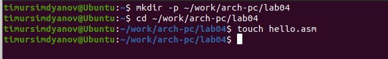
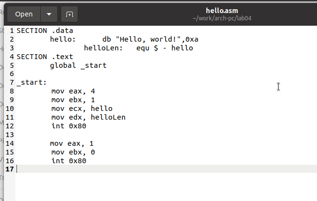
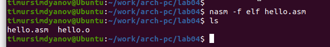
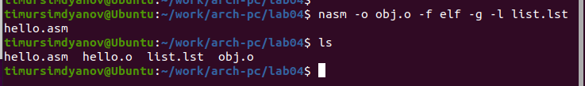
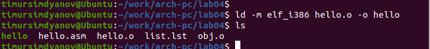
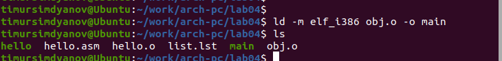
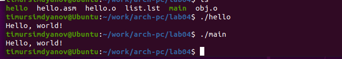
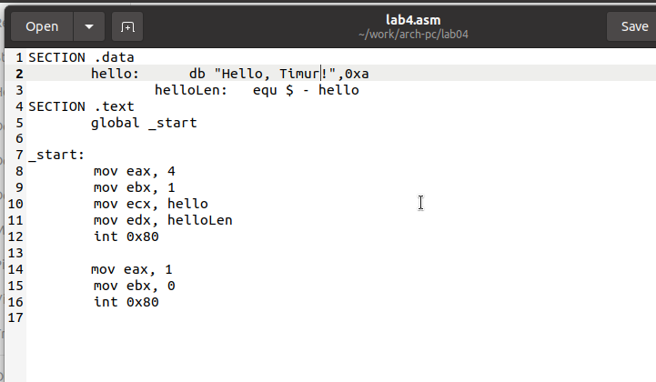
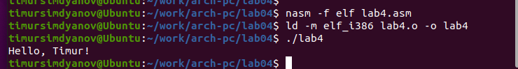

---
## Front matter
title: "Отчёт по лабораторной работе 4"
subtitle: "дисциплина:	Архитектура компьютера"
author: "Симдянов Тимур НПИбд-03-24 "

## Generic otions
lang: ru-RU
toc-title: "Содержание"

## Bibliography
bibliography: bib/cite.bib
csl: pandoc/csl/gost-r-7-0-5-2008-numeric.csl

## Pdf output format
toc: true # Table of contents
toc-depth: 2
lof: true # List of figures
lot: true # List of tables
fontsize: 12pt
linestretch: 1.5
papersize: a4
documentclass: scrreprt
## I18n polyglossia
polyglossia-lang:
  name: russian
  options:
	- spelling=modern
	- babelshorthands=true
polyglossia-otherlangs:
  name: english
## I18n babel
babel-lang: russian
babel-otherlangs: english
## Fonts
mainfont: PT Serif
romanfont: PT Serif
sansfont: PT Sans
monofont: PT Mono
mainfontoptions: Ligatures=TeX
romanfontoptions: Ligatures=TeX
sansfontoptions: Ligatures=TeX,Scale=MatchLowercase
monofontoptions: Scale=MatchLowercase,Scale=0.9
## Biblatex
biblatex: true
biblio-style: "gost-numeric"
biblatexoptions:
  - parentracker=true
  - backend=biber
  - hyperref=auto
  - language=auto
  - autolang=other*
  - citestyle=gost-numeric
## Pandoc-crossref LaTeX customization
figureTitle: "Рис."
tableTitle: "Таблица"
listingTitle: "Листинг"
lofTitle: "Список иллюстраций"
lotTitle: "Список таблиц"
lolTitle: "Листинги"
## Misc options
indent: true
header-includes:
  - \usepackage{indentfirst}
  - \usepackage{float} # keep figures where there are in the text
  - \floatplacement{figure}{H} # keep figures where there are in the text
---

# Цель работы

Целью работы является освоение процедуры компиляции и сборки программ, написанных на ассемблере NASM.

# Выполнение лабораторной работы

## Программа Hello world!

Для начала создаю новый каталог lab04 с помощью команды mkdir, затем перехожу в него, используя команду cd. После этого создаю файл hello.asm. На рис. [-@fig:001] показан процесс создания каталога и файла.

{ #fig:001 width=70%, height=70% }

Открываю файл hello.asm в текстовом редакторе и пишу код программы по заданию, как показано на рис. [-@fig:002].

{ #fig:002 width=70%, height=70% }

## Трансляция кода с помощью NASM 

Для того чтобы скомпилировать файл, использую транслятор NASM. С помощью команды nasm я создаю объектный файл hello.o, что показано на рис. [-@fig:003].

{ #fig:003 width=70%, height=70% }

Для более детального анализа программы применяю команду nasm с дополнительными опциями, которые позволяют создать листинг (list.lst), объектный файл (obj.o), а также добавить отладочную информацию. Результат показан на рис. [-@fig:004].

{ #fig:004 width=70%, height=70% }

## Линковка с использованием LD

После успешной трансляции выполняю линковку объектного файла hello.o, используя компоновщик ld. Это позволяет создать исполняемый файл, как показано на рис. [-@fig:005].

{ #fig:005 width=70%, height=70% }

Затем повторяю этот процесс для объектного файла obj.o, в результате чего получаю исполняемый файл с именем main. Результат показан на рис. [-@fig:006].

{ #fig:006 width=70%, height=70% }

Запускаю оба полученных исполняемых файла, как видно на рис. [-@fig:007].

{ #fig:007 width=70%, height=70% }

## Выполнение заданий для самостоятельной работы

Для выполнения индивидуального задания копирую исходную программу в новый файл. Вношу изменения в код, заменяя сообщение "Hello world" на своё имя, что продемонстрировано на рис. [-@fig:008]. После этого запускаю изменённую программу (рис. [-@fig:009]).

{ #fig:008 width=70%, height=70% }

{ #fig:009 width=70%, height=70% }

## Выводы

В ходе выполнения лабораторной работы ознакомились с основными этапами работы 
с программами на ассемблере с использованием NASM. 
