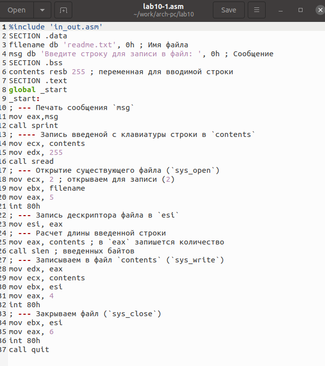
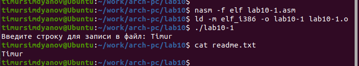
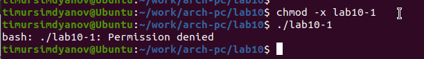
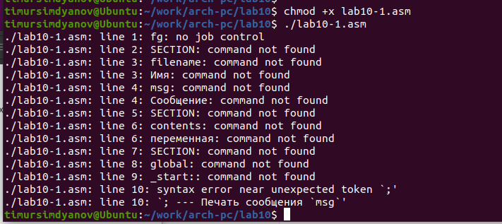
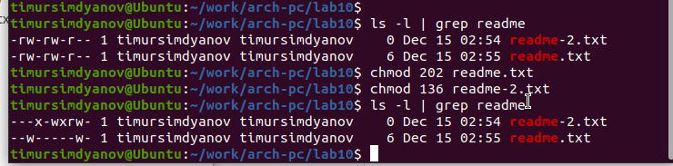
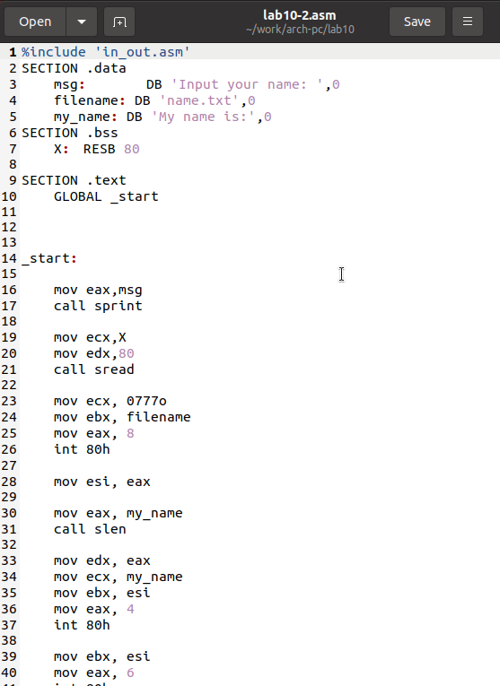
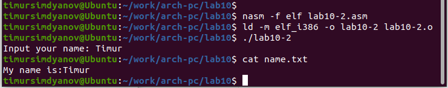

---
## Front matter
title: "Отчёт по лабораторной работе 10"
subtitle: "дисциплина:	Архитектура компьютера"
author: "Симдянов Тимур НПИбд-03-24 "

## Generic otions
lang: ru-RU
toc-title: "Содержание"

## Bibliography
bibliography: bib/cite.bib
csl: pandoc/csl/gost-r-7-0-5-2008-numeric.csl

## Pdf output format
toc: true # Table of contents
toc-depth: 2
lof: true # List of figures
lot: true # List of tables
fontsize: 12pt
linestretch: 1.5
papersize: a4
documentclass: scrreprt
## I18n polyglossia
polyglossia-lang:
  name: russian
  options:
	- spelling=modern
	- babelshorthands=true
polyglossia-otherlangs:
  name: english
## I18n babel
babel-lang: russian
babel-otherlangs: english
## Fonts
mainfont: PT Serif
romanfont: PT Serif
sansfont: PT Sans
monofont: PT Mono
mainfontoptions: Ligatures=TeX
romanfontoptions: Ligatures=TeX
sansfontoptions: Ligatures=TeX,Scale=MatchLowercase
monofontoptions: Scale=MatchLowercase,Scale=0.9
## Biblatex
biblatex: true
biblio-style: "gost-numeric"
biblatexoptions:
  - parentracker=true
  - backend=biber
  - hyperref=auto
  - language=auto
  - autolang=other*
  - citestyle=gost-numeric
## Pandoc-crossref LaTeX customization
figureTitle: "Рис."
tableTitle: "Таблица"
listingTitle: "Листинг"
lofTitle: "Список иллюстраций"
lotTitle: "Список таблиц"
lolTitle: "Листинги"
## Misc options
indent: true
header-includes:
  - \usepackage{indentfirst}
  - \usepackage{float} # keep figures where there are in the text
  - \floatplacement{figure}{H} # keep figures where there are in the text
---

# Цель работы

Целью работы является приобретение навыков написания программ для работы с файлами.

# Выполнение лабораторной работы

Создал каталог для программ лабораторной работы №10, перешел в него и создал файлы lab10-1.asm, readme-1.txt и readme-2.txt.

В файл lab10-1.asm добавил текст программы из листинга 10.1, которая выполняет запись сообщения в файл. Скомпилировал программу, создал исполняемый файл и проверил её функциональность.

{ #fig:001 width=70%, height=70% }

Программа запрашивает строку у пользователя и сохраняет её в файл readme.txt. Если файл не существует, то строка не записывается.

{ #fig:002 width=70%, height=70% }

Используя команду chmod, изменил права доступа к исполняемому файлу lab10-1, запретив его выполнение. Попытался запустить файл.

Программа не запускается, так как были убраны права на выполнение (атрибут x снят для всех пользователей).

{ #fig:003 width=70%, height=70% }

С помощью команды chmod добавил права на исполнение к файлу lab10-1.asm, содержащему исходный код программы. Попытался выполнить файл.

Терминал воспринимает содержимое файла как набор консольных команд. Поскольку инструкции ассемблера не являются командами оболочки, появляются ошибки. Однако, если в файл добавить команды оболочки, их можно будет выполнить.

{ #fig:004 width=70%, height=70% }

Изменил права доступа к файлам readme в соответствии с вариантом в таблице 10.4. Проверил результат с помощью команды ls -l.

Для варианта 4: права доступа -w- --- -w-  и в восьмеричном представлении 001 011 110.

{ #fig:005 width=70%, height=70% }

## Задание для самостоятельной работы

Написал программу, которая реализует следующий алгоритм:

1. Выводит приглашение: "Как Вас зовут?".
2. Вводит с клавиатуры фамилию и имя.
3. Создает файл name.txt.
4. Записывает в файл сообщение "Меня зовут".
5. Дописывает в файл строку, введенную пользователем.
6. Закрывает файл.

{ #fig:006 width=70%, height=70% }

{ #fig:007 width=70%, height=70% }

# Выводы

Изучены основные операции работы с файлами и управление правами доступа.
